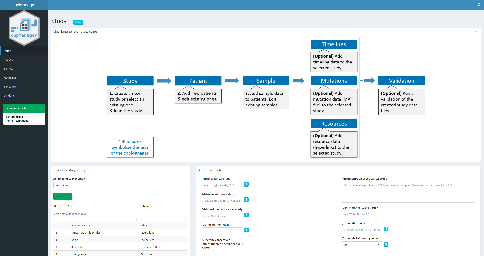

# Abstract 

Intuitive visualization and interactive exploration of multidimensional cancer genomics data sets is essential to the field of cancer genomics. The cBioPortal for Cancer Genomics is an open-access, open-source tool that can integrate different types of alterations with clinical data. "The goal of cBioPortal is to significantly lower the barriers between complex genomic data and cancer researchers by providing rapid, intuitive, and high-quality access to molecular profiles and clinical attributes from large-scale cancer genomics projects, and therefore to empower researchers to translate these rich data sets into biologic insights and clinical applications." (read more about cBioPortal for Cancer Genomics [here](https://www.cbioportal.org/faq).) cBioPortal enables the installation of an own instance for the analysis of your own data. The data for uploading to the own instance must have certain file formats. Although these specifications are documented in detail [here](https://docs.cbioportal.org/5.1-data-loading/data-loading/file-formats), the creation of such specific files is not easy for medical professionals or technically inexperienced persons and is often very time-consuming.

The R package cbpManager provides an R Shiny application that facilitates the generation of files suitable for the import in cBioPortal for Cancer Genomics. It enables the user to manage and edit clinical data maintain new patient data over time.

## Features:

- Create and edit existing and new studies
- Editing of patient data (data_clinical_patient.txt)
- Editing of sample data (data_clinical_sample.txt)
- Adding MAF files (internally these are concatenated to the data_mutations_extended.txt file)
- Edit mutation annotation data
- Edit timeline tracks (surgery, status, treatment)
- Creation and editing of user-defined timeline tracks
→ The functionality of the application is extended on a regular basis (long-term goal is to cover most of the cBioPortal's format specifications)



## Installation

```
remotes::install_github("arsenij-ust/cbpManager")

```

## Usage

cbpManager will use the `validateData.py` script from cBioPortal for Cancer Genomics inside of the application, which allows the user to validate the created files. Therefore, a conda environment will be installed. To prevent long loading times during the application usage, we can setup the conda environment with the function `cbpManager::setupConda_cbpManager()` before launch.

Run the Shiny application with the following R command:

```
cbpManager::cbpManager()
```

The installation was successful if the application starts working. 

A study to be loaded in cBioPortal can basically consist of a directory where all the data files are located (see [here](https://docs.cbioportal.org/5.1-data-loading/data-loading#preparing-study-data)). It is common to store the single study directories in one directory called e.g. "study". If you already have a cBioPortal instance installed and such a folder containing study subfolders, you should provide the path when starting the application. Optionally, you can provide a directory path where a logfile will be created.:

```
cbpManager::cbpManager(
  studyDir="path/to/study", 
  logDir="path/to/logingDirectory"
)
```

Now you can select your already existing studies in the dropdown menu.

Optionally you can provide further parameters to `cbpManager::cbpManager()` function that are used by `shiny::runApp`, e.g.
`host` or `port`.

### File naming convention

If cbpManager should recognize files of a study, the files should be named as following:

- `data_clinical_patient.txt` (Clinical Data)
- `data_clinical_sample.txt` (Clinical Data)
- `data_mutations_extended.txt` (Mutation Data)

- `meta_study.txt` (Cancer Study)
- `meta_clinical_patient.txt` (Clinical Data)
- `meta_clinical_sample.txt` (Clinical Data)
- `meta_mutations_extended.txt` (Mutation Data)

Optional files:

- `data_timeline_surgery.txt` / `meta_timeline_surgery.txt` 
- `data_timeline_status.txt` / `meta_timeline_status.txt`
- `data_timeline_treatment.txt` / `meta_timeline_treatment.txt`

Further custom timeline tracks should be named:

e.g. `data_timeline_<custom>.txt` / `meta_timeline_<custom>.txt`

For further details see [File Formats](https://docs.cbioportal.org/5.1-data-loading/data-loading/file-formats) and the 'testpatient' study in this package under 'inst/study/'.

## Dockerized usage

See [here](https://gitlab.miracum.org/arsenij_temp/cbpmanager.deploy)

## Maintainers

Arsenij Ustjanzew (arsenij.ustjanzew@uni-mainz.de)

## Contributing

Feel free to dive in! [Open an issue](https://github.com/arsenij-ust/cbpManager/issues) or submit PRs.


## License

[AGPL-3](LICENSE)
