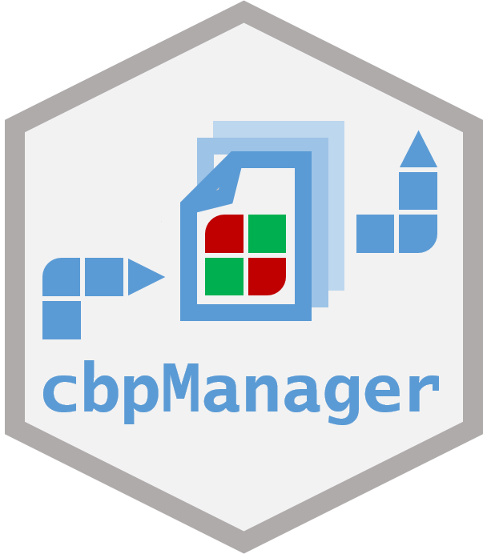

<br>
**Authors**: `r utils::packageDescription("cbpManager")[["Author"]]`<br />
**Version**: `r utils::packageDescription("cbpManager")$Version`<br />
**Compiled date**: `r Sys.Date()`<br />
**License**: `r utils::packageDescription("cbpManager")[["License"]]`<br />


```{r style, echo = FALSE, results = 'asis', include = FALSE}
BiocStyle::markdown()
```

```{r setup, include = FALSE}
knitr::opts_chunk$set(
    collapse = TRUE,
    comment = "#>",
    error = FALSE,
    warning = FALSE,
    message = FALSE
)
stopifnot(requireNamespace("htmltools"))
htmltools::tagList(rmarkdown::html_dependency_font_awesome())
```



# Introduction and scope

Intuitive visualization and interactive exploration of multidimensional cancer genomics data sets is essential to the field of cancer genomics. The cBioPortal for Cancer Genomics is an open-access, open-source tool that can integrate different types of alterations with clinical data. "The goal of cBioPortal is to significantly lower the barriers between complex genomic data and cancer researchers by providing rapid, intuitive, and high-quality access to molecular profiles and clinical attributes from large-scale cancer genomics projects, and therefore to empower researchers to translate these rich data sets into biologic insights and clinical applications." (read more about cBioPortal for Cancer Genomics [here](https://www.cbioportal.org/faq).) cBioPortal enables the installation of an own instance for the analysis of your own data. The data for uploading to the own instance must have certain file formats. Although these specifications are documented in detail [here](https://docs.cbioportal.org/5.1-data-loading/data-loading/file-formats), the creation of such specific files is not easy for medical professionals or technically inexperienced persons and is often very time-consuming.

The R package cbpManager provides an R Shiny application that facilitates the generation of files suitable for the import in cBioPortal for Cancer Genomics. It enables the user to manage and edit clinical data maintain new patient data over time. 

This tutorial gives an overview of the functionality of the Shiny application, explains how to create cancer studies and edit its metadata, upload mutation data, and create and edit clinical patient data, sample data, and timeline data.

## Installation

cbpManager is a stand-alone R package, so a user can start and use the application locally without implementing it in a larger system context.

A local installation of the latest version of R and RStudio is required.

Alternatively, cbpManager can be installed using Docker. This has the advantage that a permanent Shiny server instance of the application runs as a container and can thus be integrated into a global system context.

### Installation of the R package

The package can be installed with the `r BiocStyle::CRANpkg("remotes")` library:

```
remotes::install_github("arsenij-ust/cbpManager")

```

cbpManager will use the `validateData.py` script from cBioPortal for Cancer Genomics inside of the application, which allows the user to validate the created files. Therefore, a conda environment will be installed. To prevent long loading times during the application usage, we can setup the conda environment with the function `cbpManager::setupConda_cbpManager()` before launch.

After successful installation, the application is started with the following command (a browser window/ RStudio viewer with the application should open):

```
cbpManager::cbpManager()
```

The installation was successful if the application starts working. 

A study to be loaded in cBioPortal can basically consist of a directory where all the data files are located (see [here](https://docs.cbioportal.org/5.1-data-loading/data-loading#preparing-study-data)). It is common to store the single study directories in one directory called e.g. "study". If you already have a cBioPortal instance installed and such a folder containing study subfolders, you should provide the path when starting the application:

```
cbpManager::cbpManager(
  studyDir="path/to/study", 
  logDir="path/to/logingDirectory"
)
```

Now you can select your already existing studies in the dropdown menu.

Optionally, you can provide further parameters to `cbpManager::cbpManager()` function that are used by `shiny::runApp`, e.g. `host` or `port`.

**Attention**: If you do not pass a path to the application before starting it, the "study" directory in the installed R package will be used by default. If the package is reinstalled at a later time, all studies and files in the folder will be lost. Thus it is advisable to always pass a path (e.g. of the working directory).

### Docker deployment

The advantage of running cbpManager as a Docker container is the system integration in a larger context and allows the access for multiple users. In addition, you can integrate authentication with ShinyProxy. More information about installing cbpManager using Docker can be found on this page [LINK](https://gitlab.miracum.org/arsenij_temp/cbpmanager.deploy/).

## Functionality

### File naming convention

If cbpManager should recognize files of a study, the files should be named as following:

- `data_clinical_patient.txt` (Clinical Data)
- `data_clinical_sample.txt` (Clinical Data)
- `data_mutations_extended.txt` (Mutation Data)

- `meta_study.txt` (Cancer Study)
- `meta_clinical_patient.txt` (Clinical Data)
- `meta_clinical_sample.txt` (Clinical Data)
- `meta_mutations_extended.txt` (Mutation Data)

Optional files:

- `data_timeline_surgery.txt` / `meta_timeline_surgery.txt` 
- `data_timeline_status.txt` / `meta_timeline_status.txt`
- `data_timeline_treatment.txt` / `meta_timeline_treatment.txt`

Further custom timeline tracks should be named:

e.g. `data_timeline_<custom>.txt` / `meta_timeline_<custom>.txt`

For further details see [File Formats](https://docs.cbioportal.org/5.1-data-loading/data-loading/file-formats) and the 'testpatient' study in this package under 'inst/study/'.

### Editing studies:

On the "**Study Metadata**" page, new studies can be created and existing studies can be loaded.

```{r, out.width="100%", echo=FALSE}
knitr::include_graphics(file.path("images/1.PNG"))
```

#### Creating a new study:

To create a new study, one must first create metadata of the study. This is done in the right box "Add new study".

After clicking the `Add study` button, the study will be created in a new folder (under the defined study folder the file `meta_study.txt` will be created). This folder is named after the input value of the `Add ID of cancer study` field. Metadata of a study can be changed by specifying the ID of an existing study. 

The "cancer type" can be entered either in the drop-down menu `Select the cancer type` or alternatively in the expanded table below the metadata fields:

```{r, out.width="100%", echo=FALSE}
knitr::include_graphics(file.path("images/3.PNG"))
```

#### Loading an existing study:

In order to further process data from a study, this study must be loaded. For this purpose, the respective study must be selected in the drop-down menu `Select ID of cancer study` on the left side of the page "Study Metadata". After pressing the `Load study` button, loading is confirmed by the appearance of the metadata table:

```{r, out.width="60%", echo=FALSE}
knitr::include_graphics(file.path("images/4.PNG"))
```

### Editing patient data:

The "Patient" page is used to edit clinical patient data. In the upper area, it has a "Description" box containing important information on filling in the patient data as well as instructions for handling, and a "Sample from cBioPortal" box with an exemplary representation of the patient data in cBioPortal (both boxes are collapsed in the following image for better clarity). The "Patient manager" area contains several function buttons and a central table with the patient information. The first three light blue lines must contain a short, long name and the data type of a column. Each additional line defines a patient. 

```{r, out.width="100%", echo=FALSE}
knitr::include_graphics(file.path("images/5.PNG"))
```

#### Add new attributes (columns):

By clicking the `Add column(s)` button, new attributes can be added to the table. You can choose from predefined attributes or create a user-defined attribute:

```{r, out.width="60%", echo=FALSE}
knitr::include_graphics(file.path("images/6.PNG"))
```

```{r, out.width="60%", echo=FALSE}
knitr::include_graphics(file.path("images/6-2.PNG"))
```

The table will be extended by the selected columns:

```{r, out.width="100%", echo=FALSE}
knitr::include_graphics(file.path("images/7.PNG"))
```

#### Create new patients:

The `Add patient` button opens a dialog box containing one entry field per existing column. For predefined attributes, the input fields can be specific, e.g. drop-down menus, numeric, date input, etc. The field `PATIENT_ID` is mandatory.

```{r, out.width="60%", echo=FALSE}
knitr::include_graphics(file.path("images/8.PNG"))
```

After filling the fields and confirming with the `Add` button of the dialog window, the patient is added to the table:

```{r, out.width="100%", echo=FALSE}
knitr::include_graphics(file.path("images/10.PNG"))
```

#### Deleting attributes:

The `Delete column(s)` button opens a dialog window where you can select from already existing attributes of the table those that should be deleted. The deletion of the `PATIENT_ID` column is not allowed.

```{r, out.width="60%", echo=FALSE}
knitr::include_graphics(file.path("images/12.PNG"))
```

#### Import of patients:

It is possible to import patient data from another study (`Import patient` button). In the dialog box the study has to be selected first and then the patient ID. During the import not only patient data are imported, but also sample data, mutation data and timeline entries of the respective patient. 

```{r, out.width="60%", echo=FALSE}
knitr::include_graphics(file.path("images/9.PNG"))
```

#### Editing patient data:

To edit a patient who has already been created, the patient's row in the table must first be clicked. Then the respective row can be edited with the button `Edit patient`. Similarly, you can subsequently edit the short/long attribute name and the data type of the columns.

```{r, out.width="60%", echo=FALSE}
knitr::include_graphics(file.path("images/11.PNG"))
```

#### Deleting a patient:

When deleting a patient, you must also click on the line to be removed and then press the `Delete patient` button.

**Warning:** The sample data and timeline tracks of the corresponding patient are not deleted and must also be cleaned up in the respective tables.

#### Saving the patient data:

After the table has been edited, the `Save` button must be pressed. Only then the files `data_clinical_patient.txt` & `meta_clinical_patient.txt` are created/ overwritten and thus the changes are permanent!

### Editing sample data:

The table of sampled data on the "Sample" page is similar to the table of patient data. However, here the columns `PATIENT_ID` and `SAMPLE_ID` are mandatory. The operation of editing the table is also analogous to that of patients.

**Warning:** To create a sample (row) and assign it to a patient, patients must be created first.

```{r, out.width="100%", echo=FALSE}
knitr::include_graphics(file.path("images/13.PNG"))
```

### Mutation data (MAF):

The "Mutations" page offers the user the possibility to upload mutation annotation format (MAF) files. If the study already contains mutation data, the content of the uploaded MAF file will be concatenated to the already existing data by clicking on the `Add uploaded data to existing mutation data` button. Columns of the uploaded file, that are new and not present in the existing data, will be added. Columns with similar names between the uploaded file and the already existing mutation data will be merged together. The MAF file must meet certain requirements, i.e. contain specific columns (see [link](https://docs.cbioportal.org/5.1-data-loading/data-loading/file-formats#data-file-5)). Similarly to the previous tabs, the user can add, edit, and delete single mutations, and add or delete columns of the table at the bottom of the page. As always, saving is required to make the changes permanent.

```{r, out.width="100%", echo=FALSE}
knitr::include_graphics(file.path("images/14.PNG"))
```

### Editing timelines:

The "Timelines" page offers the possibility to edit the timeline tracks "Treatment", "Surgery" and "Status". Furthermore, it is possible to create and edit user-defined timeline tracks.

Since cBioPortal uses the number of days since the initial diagnosis instead of a specific date for the start or end of a timeline event, one would have to specify the initial diagnosis date for each event as well. This is repetitive and time-consuming in total, which is why we decided to create a patient first diagnosis date table as an intermediate step. So before you can add timeline events to a timeline track, you have to assign a diagnosis date to the patient. This is done in the box `Add date of the first diagnosis to a Patient ID`. In the timeline tracks you only have to select the patient ID to which this event belongs and the cbpManager calculates the number of days until the given date automatically.

```{r, out.width="100%", echo=FALSE}
knitr::include_graphics(file.path("images/15.PNG"))
```

The three timeline tracks "Treatment", "Surgery" and "Status" are shown in the tabs:

```{r, out.width="100%", echo=FALSE}
knitr::include_graphics(file.path("images/16.PNG"))
```

To create custom timeline tracks, you must first specify the name of the timeline track and define whether the event has a time span (`timeline`) or is a point event (`timepoint`). This is relevant because timeline events have a start and stop date and timepoint events only need to have a start date. To edit a timeline track, you should select it from the drop-down menu and click `Edit track` to confirm the selection. The data of the timeline track will be displayed in the table below. Again, each change must be saved with `Save` to make it persistent. 

```{r, out.width="100%", echo=FALSE}
knitr::include_graphics(file.path("images/17.PNG"))
```

### Manage resources data:

In the "Resources" tab, you can add additional resources to patients, samples and studies. It generates in cBioPortal a hyperlink and a tab containing the web based resource, e.g. another webpage. With this principle you can add pdf, txt, png resources or webpages to your study.

At first, we need to define a resource before adding a URL to a specific sample or patient. The first table creates the necessary resource definition file. The resource definition file should follow this format, it has three required columns: 

- RESOURCE_ID: a unique resource ID. This field allows only numbers, letters, points, underscores and hyphens.
- DISPLAY_NAME: a display name for resources.
- RESOURCE_TYPE: resource type for resources. It describes to which part of the study this resource is to be assigned and must be 'SAMPLE', 'PATIENT' or 'STUDY'.

After we defined a resource, we can add a URL link to the study, a specific patient, or a specific sample. E.g. we defined a resource with the RESOURCE_ID 'test_resource' and the RESOURCE_TYPE 'PATIENT', then we go the the 'Patients' tabpanel in this area, click on the 'Add' button, select an existing PATIENT_ID, select our recource with the ID 'test_resource', and add a URL.

```{r, out.width="100%", echo=FALSE}
knitr::include_graphics(file.path("images/19.PNG"))
```

### Validating created study

The tab "Validation" allows the user quickly validate the created or modified study files. The validation checks whether the study is suitable for the upload in cBioPortal. In background the cBioPortal `validateData.py` script is used.

The report generation is triggered by the `Validate` button. After, the report can be downloaded.

```{r, out.width="100%", echo=FALSE}
knitr::include_graphics(file.path("images/18.PNG"))
```

## Upload to cBioPortal for Cancer Genomics.

**Warning:** Note that cbpManager only generates the files in the appropriate format for cBioPortal. However, the upload must be done manually after the files have been generated using the usual cBioPortal scripts. 

# Session Info {.unnumbered}

```{r sessioninfo}
utils::sessionInfo()
```
